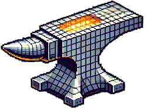

<p align="center">
  
</p>

# SmithForge: WebUI Edition

SmithForge WebUI is a web-based interface for the SmithForge tool, which allows you to seamlessly combine two 3MF models by overlaying and embedding a Hueforge model onto a base shape with automatic scaling, positioning, and precise intersection alignment. This project includes a Docker setup for easy deployment.

## Features

- Web-based interface for SmithForge
- **Interactive 3D Model Preview** - Visualize your models before processing
- Upload and process 3MF models
- Automatic scaling and positioning
- Customizable rotation and shifts
- **Parameter Presets** - Save and load your favorite parameter combinations
- Dockerized for easy deployment

## Requirements

- Docker
- Docker Compose
- Docker Desktop (optional for ease of use)

## Installation

1. Clone the repository with submodules:
    ```bash
    git clone --recurse-submodules https://github.com/yourusername/smithforge-webui.git
    cd smithforge-webui
    ```

2. Build and run the Docker container:
    ```bash
    docker-compose up --build -d
    ```
    ```yaml
    version: '3'
    services:
      smithforge-webui:
        build: .
        ports:
          - "8000:8000"
    ```

3. Access the web interface at `http://localhost:8000`.

## Usage
1. Open the web interface in your browser.
2. Upload the Hueforge and base 3MF models.
3. Configure the optional settings as needed.
4. Click "Start Forging" to process the models.
5. Download the combined 3MF model once the process is complete.

## 3D Model Preview

The 3D Model Preview feature allows you to visualize your uploaded models in an interactive 3D viewer before processing, helping you verify your models and catch potential issues early.

### How to Use

1. **Upload Models**: When you upload your Hueforge or base model files, they will automatically appear in the 3D viewer
2. **Navigate the View**:
   - **Rotate**: Left-click and drag
   - **Pan**: Right-click and drag
   - **Zoom**: Scroll mouse wheel
3. **View Controls**:
   - **Both**: Show both base and overlay models together (default)
   - **Base Only**: Show only the base model
   - **Overlay Only**: Show only the Hueforge overlay model
4. **Wireframe Mode**: Toggle to see the model's mesh structure

### Model Information

The preview panel displays useful information about each model:
- **Dimensions**: Width × Height × Depth in millimeters
- **Volume**: Approximate volume in cubic millimeters
- **Loading Status**: Visual indicator while models are being processed

### Technical Details

- Models are converted from 3MF to GLB format on-the-fly for web display
- The viewer uses Three.js for hardware-accelerated 3D rendering
- Base model appears in gray, overlay model in blue with transparency
- Grid helper shows scale and orientation

### Benefits

- **Verify Models**: Ensure your models loaded correctly before processing
- **Check Alignment**: Visual confirmation of model positioning
- **Early Error Detection**: Spot issues with model geometry or size
- **Better Understanding**: See exactly what will be processed

## Parameter Presets

Parameter Presets allow you to save and reuse your frequently-used parameter combinations, making it faster to work with similar projects.

### Saving a Preset

1. Configure all your desired parameters (rotation, scaling, shifts, etc.)
2. Enter a name for your preset in the "Save Current Settings" field
3. Click the "Save Preset" button
4. Your preset is now saved in your browser's local storage

### Loading a Preset

1. Select a preset from the "Load Saved Preset" dropdown
2. Click the "Load" button
3. All form fields will be populated with the saved values

### Deleting a Preset

1. Select a preset from the "Load Saved Preset" dropdown
2. Click the "Delete" button
3. Confirm the deletion

### What Gets Saved

Presets save the following parameters:
- Base rotation angle
- Force scale value
- Scale down permission
- X, Y, Z position shifts
- Color preservation setting
- Output filename template
- Base template selection (default bases or upload)

**Note:** Presets are stored locally in your browser using localStorage. They will persist between sessions but are not synced across different browsers or devices.

## License

This project is licensed under the GNU General Public License v3.0. See the [LICENSE](http://_vscodecontentref_/0) file for details.

## Contributing

Contributions are welcome! Please open an issue or submit a pull request for any improvements or bug fixes.

## Acknowledgements

- [trimesh](https://github.com/mikedh/trimesh)
- [FastAPI](https://fastapi.tiangolo.com/)
- [Docker](https://www.docker.com/)