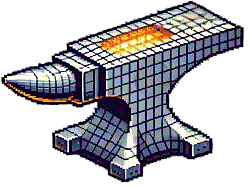

<p align="center">
  
</p>

# SmithForge: WebUI Edition

SmithForge WebUI is a web-based interface for the SmithForge tool, which allows you to seamlessly combine two 3MF models by overlaying and embedding a Hueforge model onto a base shape with automatic scaling, positioning, and precise intersection alignment. This project includes a Docker setup for easy deployment.

## Features

- Web-based interface for SmithForge
- Upload and process 3MF models
- Automatic scaling and positioning
- Customizable rotation and shifts
- Dockerized for easy deployment

## Requirements

- Docker
- Docker Compose
- Docker Desktop (optional for ease of use)

## Installation

1. Clone the repository:
    ```bash
    git clone https://github.com/yourusername/smithforge-webui.git
    cd smithforge-webui
    ```

2. Build and run the Docker container:
    ```bash
    docker-compose up --build -d
    ```
    ```yaml
    version: '3'
    services:
      smithforge-webui:
        build: .
        ports:
          - "8000:8000"
    ```

3. Access the web interface at `http://localhost:8000`.

## Usage
1. Open the web interface in your browser.
2. Upload the Hueforge and base 3MF models.
3. Configure the optional settings as needed.
4. Click "Start Forging" to process the models.
5. Download the combined 3MF model once the process is complete.


## License

This project is licensed under the GNU General Public License v3.0. See the [LICENSE](http://_vscodecontentref_/0) file for details.

## Contributing

Contributions are welcome! Please open an issue or submit a pull request for any improvements or bug fixes.

## Acknowledgements

- [trimesh](https://github.com/mikedh/trimesh)
- [FastAPI](https://fastapi.tiangolo.com/)
- [Docker](https://www.docker.com/)